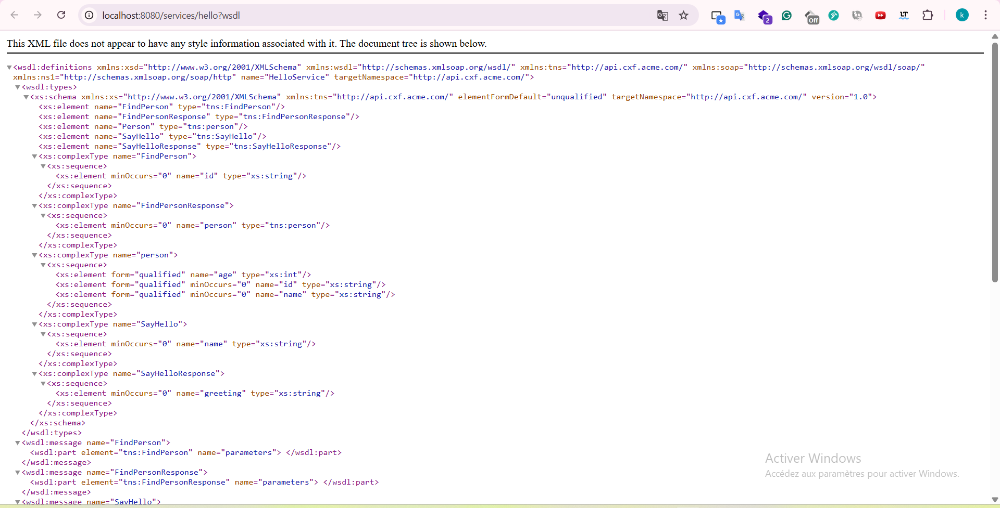
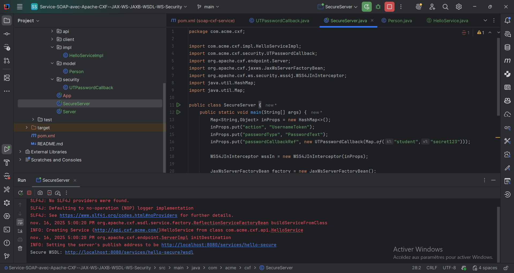
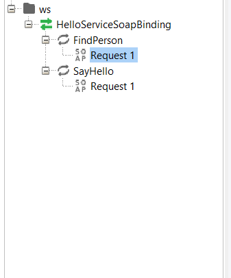
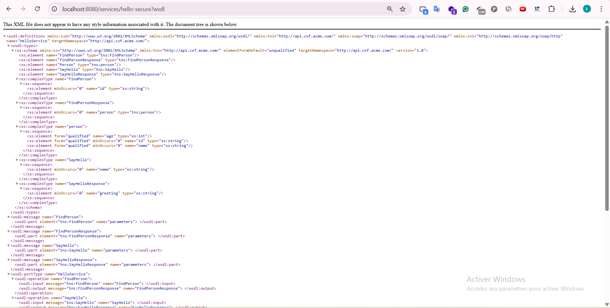
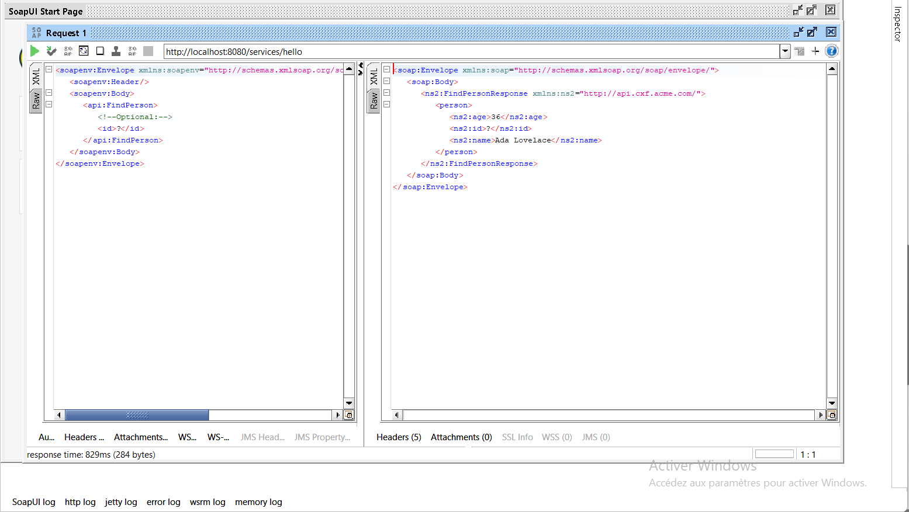
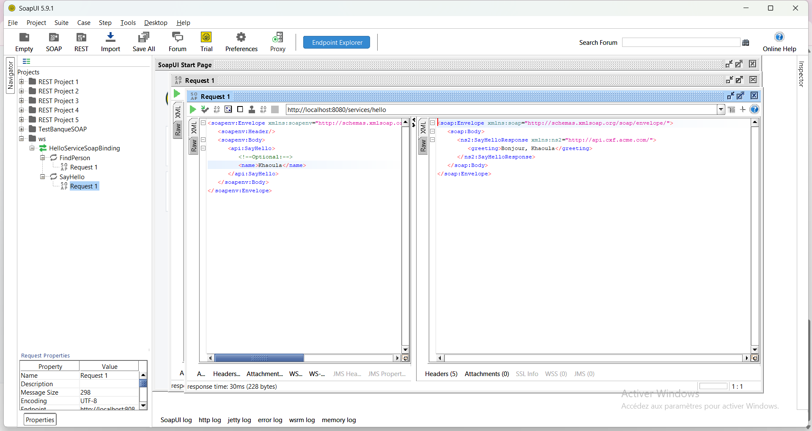
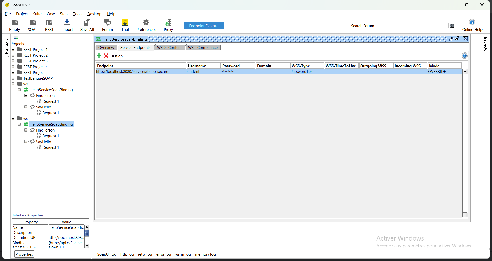

# Service SOAP avec Apache CXF (JAX-WS, JAXB, WS-Security)

Implémentation d’un petit service SOAP avec Apache CXF : opérations `SayHello` et `FindPerson`, modèle JAXB, exposition WSDL et sécurisation WS-Security (UsernameToken).

## Lancer le service
- Construire le projet : `mvn clean package`
- Démarrer le serveur simple : exécuter la classe `Server`.
- Démarrer le serveur sécurisé (UsernameToken) : exécuter la classe `SecureServer`.

Exemple de log (secure) :

## WSDL
- Service non sécurisé : http://localhost:8080/services/hello?wsdl  

- Service sécurisé : http://localhost:8080/services/hello-secure?wsdl  

## Tests SoapUI
- Créer un projet SoapUI à partir de l’URL du WSDL.
- Tester les opérations `FindPerson` et `SayHello`.

Pour le service sécurisé, configurer dans SoapUI un `Outgoing WS-Security Configuration` de type **UsernameToken** avec :
- Username : `student`
- Password : `secret123`

